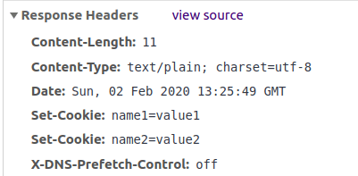
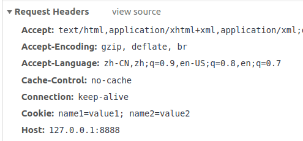
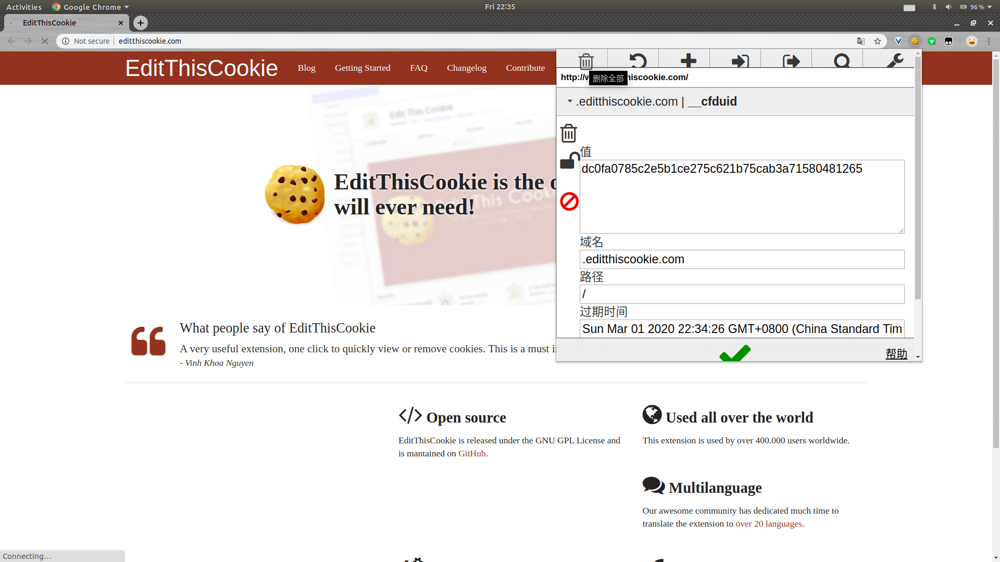

cookie 大家应该都熟悉，比如说登录某些网站一段时间后，就要求你重新登录；再比如有的同学很喜欢玩爬虫技术，有时候网站就是可以拦截住你的爬虫，这些都和 cookie 有关。如果你明白了服务器后端对于 cookie 和 session 的处理逻辑，就可以解释这些现象，甚至钻一些空子无限白嫖，待我慢慢道来。

### 一、session 和 cookie 简介

cookie 的出现是因为 HTTP 是无状态的一种协议，换句话说，服务器记不住你，可能你每刷新一次网页，就要重新输入一次账号密码进行登录。这显然是让人无法接受的，cookie 的作用就好比服务器给你贴个标签，然后你每次向服务器再发请求时，服务器就能够 cookie 认出你。

抽象地概括一下：**一个 cookie 可以认为是一个「变量」，形如 `name=value`，存储在浏览器；一个 session 可以理解为一种数据结构，多数情况是「映射」（键值对），存储在服务器上**。

注意，我说的是「一个」cookie 可以认为是一个变量，但是服务器可以一次设置多个 cookie，所以有时候说 cookie 是「一组」键值对儿，这也可以说得通。

cookie 可以在服务器端通过 HTTP 的 SetCookie 字段设置 cookie，比如我用 Go 语言写的一个简单服务：

```go
func cookie(w http.ResponseWriter, r *http.Request) {
    // 设置了两个 cookie 
	http.SetCookie(w, &http.Cookie{
		Name:       "name1",
		Value:      "value1",
	})

	http.SetCookie(w, &http.Cookie{
		Name:  "name2",
		Value: "value2",
	})
    // 将字符串写入网页
	fmt.Fprintln(w, "页面内容")
}
```

当浏览器访问对应网址时，通过浏览器的开发者工具查看此次 HTTP 通信的细节，可以看见服务器的回应发出了两次 `SetCookie` 命令：



在这之后，浏览器的请求中的 `Cookie` 字段就带上了这两个 cookie：



**cookie 的作用其实就是这么简单，无非就是服务器给每个客户端（浏览器）打的标签**，方便服务器辨认而已。当然，HTTP 还有很多参数可以设置 cookie，比如过期时间，或者让某个 cookie 只有某个特定路径才能使用等等。

但问题是，我们也知道现在的很多网站功能很复杂，而且涉及很多的数据交互，比如说电商网站的购物车功能，信息量大，而且结构也比较复杂，无法通过简单的 cookie 机制传递这么多信息，而且要知道 cookie 字段是存储在 HTTP header 中的，就算能够承载这些信息，也会消耗很多的带宽，比较消耗网络资源。

session 就可以配合 cookie 解决这一问题，比如说一个 cookie 存储这样一个变量 `sessionID=xxxx`，仅仅把这一个 cookie 传给服务器，然后服务器通过这个 ID 找到对应的 session，这个 session 是一个数据结构，里面存储着该用户的购物车等详细信息，服务器可以通过这些信息返回该用户的定制化网页，有效解决了追踪用户的问题。

**session 是一个数据结构，由网站的开发者设计，所以可以承载各种数据**，只要客户端的 cookie 传来一个唯一的 session ID，服务器就可以找到对应的 session，认出这个客户。

当然，由于 session 存储在服务器中，肯定会消耗服务器的资源，所以 session 一般都会有一个过期时间，服务器一般会定期检查并删除过期的 session，如果后来该用户再次访问服务器，可能就会面临重新登录等等措施，然后服务器新建一个 session，将 session ID 通过 cookie 的形式传送给客户端。

那么，我们知道 cookie 和 session 的原理，有什么切实的好处呢？**除了应对面试，我给你说一个鸡贼的用处，就是可以白嫖某些服务**。

有些网站，你第一次使用它的服务，它直接免费让你试用，但是用一次之后，就让你登录然后付费继续使用该服务。而且你发现网站似乎通过某些手段记住了你的电脑，除非你换个电脑或者换个浏览器才能再白嫖一次。

那么问题来了，你试用的时候没有登录，网站服务器是怎么记住你的呢？这就很显然了，服务器一定是给你的浏览器打了 cookie，后台建立了对应的 session 记录你的状态。你的浏览器在每次访问该网站的时候都会听话地带着 cookie，服务器一查 session 就知道这个浏览器已经免费使用过了，得让它登录付费，不能让它继续白嫖了。

那如果我不让浏览器发送 cookie，每次都伪装成一个第一次来试用的小萌新，不就可以不断白嫖了么？浏览器会把网站的 cookie 以文件的形式存在某些地方（不同的浏览器配置不同），你把他们找到然后删除就行了。但是对于 Firefox 和 Chrome 浏览器，有很多插件可以直接编辑 cookie，比如我的 Chrome 浏览器就用的一款叫做 EditThisCookie 的插件，这是他们官网：



这类插件可以读取浏览器在当前网页的 cookie，点开插件可以任意编辑和删除 cookie。**当然，偶尔白嫖一两次还行，不鼓励高频率白嫖，想常用还是掏钱吧，否则网站赚不到钱，就只能取消免费试用这个机制了**。

以上就是关于 cookie 和 session 的简单介绍，cookie 是 HTTP 协议的一部分，不算复杂，而 session 是可以定制的，所以下面详细看一下实现 session 管理的代码架构吧。

### 二、session 的实现

session 的原理不难，但是具体实现它可是很有技巧的，一般需要三个组件配合完成，它们分别是 `Manager`、`Provider` 和 `Session` 三个类（接口）。


1、浏览器通过 HTTP 协议向服务器请求路径 `/content` 的网页资源，对应路径上有一个 Handler 函数接收请求，解析 HTTP header 中的 cookie，得到其中存储的 sessionID，然后把这个 ID 发给 `Manager`。

2、`Manager` 充当一个 session 管理器的角色，主要存储一些配置信息，比如 session 的存活时间，cookie 的名字等等。而所有的 session 存在 `Manager` 内部的一个 `Provider` 中。所以 `Manager` 会把 `sid`（sessionID）传递给 `Provider`，让它去找这个 ID 对应的具体是哪个 session。

3、`Provider` 就是一个容器，最常见的应该就是一个散列表，将每个 `sid` 和对应的 session 一一映射起来。收到 `Manager` 传递的 `sid` 之后，它就找到 `sid` 对应的 session 结构，也就是 `Session` 结构，然后返回它。

4、`Session` 中存储着用户的具体信息，由 Handler 函数中的逻辑拿出这些信息，生成该用户的 HTML 网页，返回给客户端。

那么你也许会问，为什么搞这么麻烦，直接在 Handler 函数中搞一个哈希表，然后存储 `sid` 和 `Session` 结构的映射不就完事儿了？

**这就是设计层面的技巧了**，下面就来说说，为什么分成 `Manager`、`Provider` 和 `Session`。


先从最底层的 `Session` 说。既然 session 就是键值对，为啥不直接用哈希表，而是要抽象出这么一个数据结构呢？

第一，因为 `Session` 结构可能不止存储了一个哈希表，还可以存储一些辅助数据，比如 `sid`，访问次数，过期时间或者最后一次的访问时间，这样便于实现想 LRU、LFU 这样的算法。

第二，因为 session 可以有不同的存储方式。如果用编程语言内置的哈希表，那么 session 数据就是存储在内存中，如果数据量大，很容易造成程序崩溃，而且一旦程序结束，所有 session 数据都会丢失。所以可以有很多种 session 的存储方式，比如存入缓存数据库 Redis，或者存入 MySQL 等等。

因此，`Session` 结构提供一层抽象，屏蔽不同存储方式的差异，只要提供一组通用接口操纵键值对：

```go
type Session interface {
    // 设置键值对
    Set(key, val interface{})
    // 获取 key 对应的值
    Get(key interface{}) interface{}
    // 删除键 key
	Delete(key interface{})
}
```

再说 `Provider` 为啥要抽象出来。我们上面那个图的 `Provider` 就是一个散列表，保存 `sid` 到 `Session` 的映射，但是实际中肯定会更加复杂。我们不是要时不时删除一些 session 吗，除了设置存活时间之外，还可以采用一些其他策略，比如 LRU 缓存淘汰算法，这样就需要 `Provider` 内部使用哈希链表这种数据结构来存储 session。

PS：关于 LRU 算法的奥妙，参见前文「LRU 算法详解」。

因此，`Provider` 作为一个容器，就是要屏蔽算法细节，以合理的数据结构和算法组织 `sid` 和 `Session` 的映射关系，只需要实现下面这几个方法实现对 session 的增删查改：

```go
type Provider interface {
    // 新增并返回一个 session
    SessionCreate(sid string) (Session, error)
    // 删除一个 session
    SessionDestroy(sid string)
    // 查找一个 session
    SessionRead(sid string) (Session, error)
    // 修改一个session
    SessionUpdate(sid string)
    // 通过类似 LRU 的算法回收过期的 session
	SessionGC(maxLifeTime int64)
}
```


最后说 `Manager`，大部分具体工作都委托给 `Session` 和 `Provider` 承担了，`Manager` 主要就是一个参数集合，比如 session 的存活时间，清理过期 session 的策略，以及 session 的可用存储方式。`Manager` 屏蔽了操作的具体细节，我们可以通过 `Manager` 灵活地配置 session 机制。

综上，session 机制分成几部分的最主要原因就是解耦，实现定制化。我在 Github 上看过几个 Go 语言实现的 session 服务，源码都很简单，有兴趣的朋友可以学习学习：

https://github.com/alexedwards/scs

https://github.com/astaxie/build-web-application-with-golang
