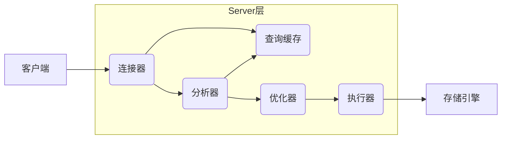
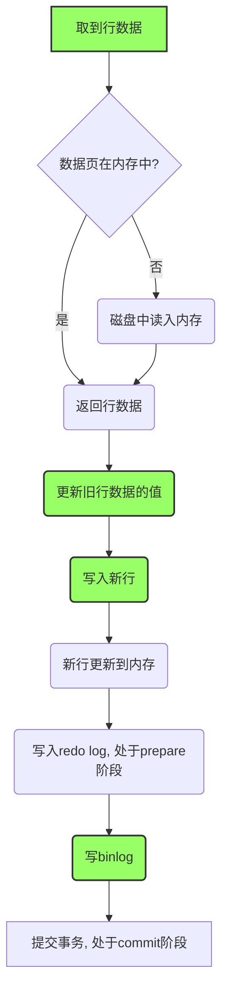

# 1 MySQL的基础架构：查询语句如何执行？



---

## 1.1 **连接器：管理连接，权限验证**

+ 权限（仅为能否连接的权限）在此处验证，即使修改了权限也只对新连接有效。
+ `show processlist`可查看连接状态，客户端超过`wait_timeout`（默认8小时）时间没动静，连接器断开连接。
+ 长连接：客户端持续有请求，一直使用同一个连接；短连接：每次执行完很少的几次查询就断开连接。
+ 建立连接一般比较复杂，但使用长连接后，内存消耗越来越大。有以下两种方案：
  - 定期断开长连接或者执行过一个占用内存的大查询后断开连接；
  - 每次执行了一个比较大的操作后，执行`mysql_reset_connection`初始化连接资源到刚创建连接完时的状态（MySQL 5.7或更高版本）。

## 1.2 **查询缓存：命中则直接返回结果**

- key-查询语句，value-查询结果。

- 表上只要有一个更新，这个表上所有的查询缓存都被清空。

- 设置`query_cache_type = DEMAND`，SQL语句默认不使用查询缓存。

- 对于确定要使用查询缓存的语句，可使用`SQL_CACHE`显示指定，即

  ```mysql
  select SQL_CACHE * from T where ID=10;
  ```

- 命中返回结果时，做表的权限验证。
- MySQL 8.0版本直接将查询缓存的整块功能删掉了。

## 1.3 **分析器：先词法分析，后语法分析**

- 词法分析：查询语句中的字符串分别是什么，代表什么，并判断库名、表名、列名存不存在。
- 语法分析：判断SQL语句是否符合MySQL语法。

## 1.4 **优化器：执行计划生成，索引选择**

- 表里有多个索引时，优化器决定使用哪个索引；
- 一个语句有多表关联（join）时，优化器决定各个表的连接顺序。
- ***有时也会在优化器之前调用precheck验证权限？***

## 1.5 **执行器：操作引擎，返回结果**

- 先判断是否有查询表的权限，再利用引擎接口执行SQL语句。
- `rows_examined`表示语句执行时扫描了多少行，执行器每次调用引擎获取数据行时累加该值。
- 在某些场景下，执行器调用一次，在引擎内部则扫描了多行，因此有时会“**引擎扫描行数  ≠  rows_examined**"。

- **存储引擎：存储数据，提供读写接口**

---

# 2 物理日志redo log和逻辑日志binlog：更新语句如何执行？

​		更新语句也会走一遍查询语句走过的流程，与查询流程不同的是，更新流程还涉及redo log和binlog。更新语句共涉及到内存、redo log（ib_log_fileX）、数据表空间（t.ibd)、系统表空间（ibdata1）、binlog五个部分。

## 2.1 **物理日志redo log（InnoDB）**

- WAL(Write-Ahead Logging)：先写日志redo log，再写磁盘。

- redo log文件数目固定，大小固定，循环写入。write pos记录当前记录的位置，checkpoint记录当前要擦除的位置。write pos与checkpoint之间是空着的地方，write pos追着checkpoint写入日志，擦除记录前把记录更新到数据文件。若write pos追上checkpoint，需停止业务写入，擦除最旧的记录，推进checkpoint。

  

- crash-safe：redo log使得InnoDB可以确保即使数据库发生重启，之前提交的记录都不会丢失。

- 设置`innodb_flush_log_at_trx_commit=1`使得每次事务的redo log都直接持久化到磁盘，保证MySQL异常重启之后数据不丢失。

## 2.2 **逻辑日志binlog（Server层）**

- binlog称为归档日志，记录的是SQL语句的原始逻辑，追加写；redo log记录的是“在某个数据页上做了什么修改”，循环写。
- 设置`sync_binlog=1`使得每次事物的binlog都直接持久化到磁盘，保证MySQL异常重启之后binlog不丢失。

## 2.3 **两阶段提交：执行器和InnoDB引擎执行更新语句**



​																								绿色：执行器中执行；灰色：InnoDB引擎内部执行

- 两阶段提交的目的：使redo log和binlog之间的逻辑一致。
- 两阶段提交是跨系统维持数据逻辑一致性的常用方案。

# 3 事务的隔离性和隔离级别

## 3.1 **事务的四大特性（ACID）**

- 原子性（Atomicity）：处于同一个事务中的多条语句是不可分割的。
- 一致性（Consistency）：事务必须使数据库从一个一致性状态变换到另外一个一致性状态。
- 隔离性（Isolation）：多线程环境下，一个线程中的事务不能被其他线程中的事务干扰。
- 持久性（Durability）：事务一旦提交，就应该被永久保存起来。

## 3.2 **隔离级别**

- 事务隔离性越好，效率就越低。从上往下，隔离性递增。

|                              | 脏读（dirty read） | 不可重复读（non-repeatable read） | 幻读（phantom read） |
| ---------------------------- | ------------------ | --------------------------------- | -------------------- |
| 读未提交（read uncommitted） | ×                  | ×                                 | ×                    |
| 读提交（read committed）     | √                  | ×                                 | ×                    |
| 可重复读（repeatable read）  | √                  | √                                 | ×                    |
| 串行化（serializable）       | √                  | √                                 | √                    |

- 多个事务同时执行时，可能出现
  - 脏读：一个线程中的事务读取到了另外一个线程中未提交的数据。
  - 不可重复读：一个线程中的事务读取到了另外一个线程中提交的update的数据。
  - 幻读：一个线程中的事务读取到了另外一个线程中提交的insert的数据。
- 隔离级别释义
  - 读未提交（ru）：事务提交之前，其他事务就能看到它的变更。
  - 读提交（rc）：事务提交之后，其他事务才能看到它的变更。
  - 可重复读（rr）：一个事务提交之前，看到的总是与启动时看到的数据一致。
  - 串行化（s）：对同一行记录，后访问的事务必须等待前访问的事务执行完成，才能继续执行。
- 隔离级别的实现
  - 读未提交（ru）：直接返回记录上的最新值，没有视图概念。
  
  - 读提交（rc）：在每个select语句开始执行时创建视图（read view），详述见下文。
  
  - 可重复读（rr）：在事务启动（执行第一个select语句）时创建视图（read view），详述见下文。
  
    ```mysql
    set session transaction isolation level repeatable read; # 设置rr隔离级别
    start transaction with consistent snapshot;              # 执行完该语句就可获得一致性视图
    ```
  
  - 串行化（s）：直接用加锁的方式避免并行访问。
- Oracle数据库的默认隔离级别为“rc”。配置`transaction_isolation=READ-COMMITTED`可使隔离级别为“rc”。

## 3.3 **事务隔离级别rc和rr的实现：MVCC(多版本并发控制)**

### 3.3.1 版本链

- 对于使用InnoDB引擎的表来说，它的聚簇索引记录中包含两个必要的隐藏列：
  - trx_id：当前记录的事务id。
  - roll_pointer：类似指针，指向该记录修改前的信息。
- 每进行一次update操作， 都会记录一次undo日志（回滚日志），即该记录的一个版本。每条undo日志的内容包含主键、更新后的列值以及trx_id和roll_pointer。同一个主键的所有更新记录通过roll_pointer串成一个链表，构成版本链。版本链的起始端一定是该主键的insert操作，insert操作对应的undo日志没有roll_pointer属性。
- undo log的重要功能之一是回滚没有提交的事务。

### 3.3.2 read view：主要记录当前系统中的活跃事务id。

- read view不含表结构。

- rc和rr的实现关键在于：判断版本链中的哪个版本对于当前事务是可见的。

- 如何判断被访问版本对于当前事务可见（即判断执行select操作之后的返回结果）：
  - 若被访问版本的trx_id比最小的活跃事务id还小，则说明该版本对应的事务在生成read view之前就已提交，所以该版本对于当前事务可见；
  - 若被访问版本的trx_id比最大的活跃事务id还大，则说明该版本对应的事务在生成read view之后才可能被提交，所以该版本对于当前事务不可见；
  - 若被访问版本的trx_id在活跃事务id最小值与最大值之间，则需判断：若trx_id为记录的活跃事务id之一（非当前事务id，当前事务id对于当前事务总是可见的），则该版本对于当前事务不可见；若trx_id不在活跃事务id之列，则该版本对于当前事务可见。
  
  通俗地讲，即一个数据版本对于一个事务视图来说，除了自己的更新总是可见以外，总是有
  
  - 版本已提交，而且是在视图创建前提交，可见；
  - 版本已提交，但是在视图创建后提交，不可见；
  - 版本未提交，不可见。 
  
- 从版本链中最新的版本开始，依次判断其对当前事务的可见性直到获取到可见的版本。若所有的版本都不可见，则说明该记录对于当前事务不可见。

- 事务id的分配：只有第一次真正修改记录（增删改）时，才会分配一个递增的事务id。

- 当系统中没有比某个undo log更早的read view，该undo log会被系统删除。

- update操作总是先读后写，读是“当前读”，即获取的总是版本链上最新的记录。

- select语句加锁后，也是“当前读”。

  ```mysql
  select k from tuser where id = 1 lock in share mode; # 加了读锁（S锁，共享锁）
  select k from tuser where id = 1 for update;         # 加了写锁（X锁，排他锁）
  ```

### 3.3.3 总结

​		MVCC在MySQL中实际上指的是rc、rr隔离级别的事务在执行普通的SELECT操作时访问记录版本链的过程，这样可以使不同的事务之间的读-写、写-读并发执行，从而提升系统效率。

## 3.4 **事务的启动方式**

- 显式启动事务（推荐）

  ```mysql
  begin/start transaction;
  commit/rollback;
  OR commit work and chain; # 提交事务且自动启动下一个事务
  ```

- `set autocommit=1`（推荐）

  `set autocommit=0`可能导致意外的长事务。长事务意味着系统中极有可能存在很老的read view，自然就会存在很多很老的回滚段占据大量存储空间。

- 查询长事务

  ```mysql
  # 查询持续时间超过60s的事务
  select * from information_schema.innodb_trx where TIME_TO_SEC(timediff(now(), trx_started)) > 60;
  ```

# 4 索引

## 4.1 **索引的常见数据模型**

- 哈希表

  - 优点：等值查询速度很快，插入新记录很快。
  - 缺点：区间查询要全表扫描，速度会很慢。
  - 典型应用：Memcached及其他一些NoSQL引擎。

- 有序数组

  - 优点：在等值查询和范围查询场景中性能表现很优秀。
  - 缺点：在有序数组中间插入一个新记录速度很慢。
  - 典型应用：静态存储引擎。

- N叉树

  - “N”取决于数据块的大小。
- 索引不仅存在内存中，还要写到磁盘上，所以，应尽量少地读磁盘。
    - 使用含100万节点、树高为20的平衡二叉树查询100万行的表中一行，可能需要$20✖10ms$（机械硬盘随机读取数据块耗时约10ms）的时间，太慢！！！
    - 对于N叉树，$N=1200$，树高为4时，至少可以存储$1200^{(4-1)}\approx17亿$条记录。树根的数据块总存在于内存中，一个10亿行的表按索引查找一个值最多需访问3次磁盘，读写性能优秀。
  - N叉树适配磁盘的访问模式，已经被广泛应用于数据库存储引擎中。

## 4.2 InnoDB的索引模型

- InnoDB使用的是B+树索引模型，每一个索引对应一棵B+树。
- 索引组织表：根据主键顺序以索引的形式存放的表。

- 索引的类型
  - 根据叶子节点的内容，分为主键索引（也称聚簇索引）和非主键索引（也称二级索引）。
    - 主键索引：叶子节点存放的是整行数据，主键索引可以是多个字段，一个表只能有一个主键索引。
    - 非主键索引：叶子节点存放的是主键的值，组织方式为先按非主键索引排序再按主键排序并去重。
  - 根据索引是否可以重复，分为唯一索引和非唯一索引。
    - 唯一索引：在表上一个或者多个字段组合唯一建立的索引，主键索引是特殊的唯一索引。 
    - 非唯一索引：在表上一个或者多个字段组合建立的索引，索引可以重复。
- 回表：基于非主键索引的查询搜索非主键索引树之后再到主键索引树搜索的过程。
- 基于非主键索引的查询比基于主键索引的查询要多扫描一棵索引树，因此应尽量使用主键查询。

## 4.3  InnoDB的索引维护

- 索引维护的目的：为了维护B+树索引的有序性。

- 页分裂：原数据页已满，申请新的数据页，并将部分数据挪到新数据页的过程。

  - 页分裂导致性能降低；
  - 页分裂导致数据页的利用率降低：原本一个页的数据，现在分到两个页中，整体空间利用率降低约50%。

- 页合并：相邻两个页删除了数据，利用率降到很低，触发合并。

- 自增主键（推荐）

  - 性能：每插入一条新记录，都是追加操作，不触发挪动其他记录，也不会触发叶子节点的分裂，插入数据的性能优秀。
  - 存储空间：主键长度越小，普通索引的叶子节点就越小，普通索引占用的空间就越小。

- 用业务字段直接做主键的场景（典型的KV场景）

  1. 只有一个索引；
  2. 该索引必须是唯一索引。
  
  - 没有其他索引，因此不用考虑其他索引叶子节点大小的问题。优先考虑“尽量使用主键查询”原则。

- 重建索引可以使索引更紧凑、更省空间，但会重建整个表

  ```mysql
  # 重建非主键索引
    alter table tuser drop index k;
    alter table tuser add index(k);
  # 重建主键索引
    alter table tuser drop primary key;
    alter table tuser add primary key(id);
  # 重建表的所有索引
    alter table tuser engine=InnoDB;
  ```

## 4.4 覆盖索引：避免回表过程

- 对于普通索引，若索引“覆盖了”查询需求，即可直接提供查询结果，不需要回表，称为覆盖索引。
- 覆盖索引是一种联合索引。
- 使用覆盖索引可以减少树的搜索次数，是一个常用的的查询性能优化手段。
- 建立冗余索引来支持覆盖索引时需权衡好索引维护的代价和建立索引带来的收益。

## 4.5 最左前缀原则

- 最左前缀是什么？

  - 可以是联合索引的最左N个字段；
  - 也可以是字符串索引的最左M个字符。

- 基于最左前缀原则，如何安排联合索引中索引的字段顺序？

  第一原则：若通过调整顺序，可以少维护一个索引，则这个顺序往往是需要优先考虑采用的。

- 既有联合查询，又有基于各字段a、b的查询，如何设计索引？

  - 原则：尽量节省空间。
  - 举例：若字段a的值比字段b的值要大，则可创建（a，b）的联合索引和（b）的单字段索引。

- 对于联合索引，查询时使用模糊匹配，并不会利用最左前缀原则使用索引。

## 4.6 索引下推（5.6开始支持）

- 定义：索引遍历过程中，对索引中包含的字段先做判断，叫做索引下推。
- 好处：直接过滤掉不满足条件的记录，减少回表次数。

# 5 全局锁和表级锁

- 根据加锁的范围，MySQL中的锁大致可分为全局锁、表级锁和行锁。

## 5.1 全局锁（server层）

- 定义：对整个数据库实例加的锁。

- 加锁方式

  ```mysql
  flush tables with read lock; # 即FTWRL
  ```

- 加锁作用：使得整个库处于只读状态，其他线程的以下语句会被阻塞：

  - 数据更新语句（增删改即DML）；
  - 数据定义语句（建表、修改表结构语句即DDL）；
  - 更新类事务的提交语句。

- 执行时机：所有事务都提交完毕或所有读写都执行完毕。

- 典型应用场景：做全库逻辑备份。

  - 对于所有的表都使用支持事务的引擎的库，更好的做法是采用一致性读进行备份。

    ```mysql
    mysqldump -single-transaction ... # 导数据之前就会启动一个事务，确保拿到一致性视图
    ```

  - 对于不支持事务的引擎，如MyISAM，就只能使用FTWRL了。

  - `set global readonly=true`可使全库只读，与FTWRL相比
    
    - 在slave上，readonly对super权限无效；
    
    - readonly参数可能用作他用，设置readonly可能影响其他的逻辑；
    - 设置readonly为true之后，若客户端异常，则数据库会一直保持read only状态；而执行FTWRL之后，若客户端异常，则MySQL会自动释放这个全局锁。

## 5.2 表级锁（server层）

- 分两类：表锁和元数据锁（meta data lock，即MDL）。

### 5.2.1 表锁

- 语法

  ```mysql
  lock tables ... read/write; # 加表级锁，多个表用逗号隔开
                              # e.g. lock tables t1 read, t2 write;
  unlock tables;              # 主动释放锁，客户端断开也会自动释放
  ```

- 作用
  - 其他所有线程对t1的读、对t2的写都会阻塞；
  - 本线程只能执行读t1、读写t2的操作。

### 5.2.1 元数据锁（MDL，5.5开始支持）

- 加锁方式：不需要显式使用，在访问一个表时会自动加MDL。
- 加锁时机
  - 加MDL读锁：对一个表做增删改查操作之时；
  - 加MDL写锁：对表做结构变更操作之时。
- 锁与锁的关系
  - 读-读不互斥；
  - 读-写互斥，写-写互斥。
- 小心
  - 变更表结构需要扫描全表数据，变更大表尤其注意。
  - 变更表结构之时会使得整个表完全不可读写，变更小表也可能搞挂整个库。
- 如何安全地给小表加字段？
  - 解决长事务，比如kill掉长事务；
  - 对于热点表，kill掉长事务不管用，可在alter语句中设定等待时间（MariaDB和AliSQL均支持该语法）。

# 6 行锁（引擎层）

- InnoDB支持行锁，而MyISAM不支持行锁，其并发控制只能使用表锁。
- 两阶段锁协议
  - 行锁在需要的时候才加上；
  - 不需要了行锁的时候不会立即释放，而是要等到事务结束时才释放。
- 根据两阶段锁协议使用事务：
  - 场景：事务中需要锁多个行；
  - 方法：把最可能造成锁冲突、最可能影响并发度的锁尽量往后放。

- 解决死锁的两种策略
  - 直接进入等待，直到超时。

    ```mysql
    set innodb_lock_wait_timeout = 50; # 设置死锁超时时间，默认值为50s
    ```

  - 发起死锁检测，发现死锁后，主动回滚死锁链条中的某一个事务，让其他事务得以继续执行。（常用）

    ```mysql
    set innodb_deadlock_detect = on; # 开启死锁检测，默认开启
    ```

- 死锁检测：当一个事务被锁时，检查其所依赖的线程有没有被别人锁住，若检测到了某个线程锁住了该事务，再检测该事务是否锁住了该线程，即出现循坏等待，也就是死锁。

- 在热点行更新并且高并发的状况下，死锁检测可能消耗大量的CPU资源。解决办法：
  - 若可确保某业务一定不会出现死锁，则可临时把死锁检测关掉。
    - 风险：死锁是业务无损的，而关掉死锁检测则可能出现大量超时，这是业务有损的。
  - 在客户端做并发控制。
    - 风险：客户端很多时，总并发数仍旧会很高。
  - 在数据库服务端做并发控制。（主要方向）
    - 在中间件实现；
    - 做在MySQL里面。思路：对于相同行的更新，在进入引擎前排队。
    - 根据业务逻辑，在sql设计上优化。比如，将一行改成逻辑上的多行，减少锁冲突。

#############################################基础篇#############################################

---

# 7 如何选择普通索引和唯一索引？

## 7.1 选择索引对于查询过程的影响

​		InnoDB的数据是以数据页为单位，整体写入内存来读写的，每个页大小默认16KB。

```mysql
# 示例
select * from T where k=5; # k可能是普通索引也可能是唯一索引
```

### 7.1.1 普通索引

- 流程：查找到满足条件`k=5`的第一个记录后，需查找下一个记录，直到碰到第一个不满足条件的记录。
- 可能发生的情况：`k=5`这条记录刚好是所在数据页的最后一个，那么取下一记录必然要取下一个数据页到内存中。但这种情形发生概率很低，平均操作成本对于现有的CPU来说忽略不计。

### 7.1.2 唯一索引

- 流程：查找到第一个满足条件`k=5`的记录后，停止继续检索。

### 7.1.3 结论

- 性能差距：微乎其微。
- 理由：上述情况下，普通索引只比唯一索引多一次指针寻址和一次计算判断。

## 7.2 选择索引对于更新过程的影响

### 7.2.1 change buffer（InnoDB）

- 用途：更新数据时，若数据页不在内存中（若在直接更新），InnoDB会将更新操作缓存到change buffer。

- 特点：在内存中有拷贝，可持久化，使用的是buffer pool中的内存。

  ```mysql
  set innodb_change_buffer_max_size = 50; # change buffer的大小最多只能占用buffer pool的50%
  ```

- merge

  - 定义：将change buffer中的操作应用到原数据页，得到最新结果的过程。
  - 流程
    - 从磁盘读入数据页到内存；
    - 将change buffer记录应用到内存中数据页中；
    - 写redo log（包含数据变更和change buffer变更）。
  - 时机：访问数据页、后台定时器、数据库正常关闭。

- 好处

  - 将更新操作缓存起来，减少读磁盘，提升语句执行速度；
  - 提升内存利用率（数据读入内存需占用buffer pool）。

### 7.2.2 普通索引

- 记录更新的目标页在内存中（以insert为例）
  - 流程：找到目标位置，插入记录，执行结束。
- 记录更新的目标页不在内存中（以insert为例）
  - 流程：更新记录到change buffer，执行结束。

### 7.2.3 唯一索引

- 特点：所有更新操作都要判断操作是否违反唯一性约束，即必须将相关数据页读入内存中。
- 是否使用change buffer：否，理由：直接更新内存会更快。
- 记录更新的目标页在内存中（以insert为例）
  - 流程：找到目标位置，判断到没有冲突，插入记录，执行结束。
- 记录更新的目标页不在内存中（以insert为例）
  - 流程：数据页读入内存，判断到没有冲突，插入记录，执行结束。

### 7.2.4 结论

- 记录更新的目标页在内存中时，对于insert操作，两者差异微乎其微。
- 记录更新的目标页不在内存中时，对于insert操作，试想一下，若插入的位置均在不同的数据页，那么按唯一索引插入会有大量的随机磁盘访问，性能更差。

## 7.3 change buffer的使用场景

- 只有普通索引可以使用。
- 起到加速作用的前提：
  - 对于写多读少的业务，页面在写完之后马上被访问的概率较小，change buffer记录的变更就越多，对性能的提升越显著，常见有账单类、日志类的系统；
  - 对于写少读多的业务，页面写完之后大概率要被访问，触发merge过程，随机IO不但不会减少，反而增加了change buffer的维护代价。

## 7.4 change buffer和redo log

- 共同点：提升性能的核心机制——尽量减少随机操作。
- 不同点
  - redo log主要节省的是随机写磁盘的IO消耗（转成顺序写）；
  - change buffer主要节省的使随机读磁盘的IO消耗。

# 8 MySQL如何选择索引？

```mysql
set long_query_time=0; # 接下来的语句都被记录到慢查询日志中
```

## 8.1  影响因子

- 扫描行数；
- 是否使用临时表；
- 是否排序。

## 8.2 扫描行数

- 如何判断：根据统计信息即“区分度”估算记录数。

- 区分度：一个索引上不同的值越多，这个索引的区分度就越好。

- 基数（cardinality）：一个索引上不同的值的个数。也就是说，基数越大，区分度越好。

  ```mysql
  show index from t1; # 查看索引的基数
  
  # 设置索引统计方法
  set innodb_stats_persistent=on;  # 统计信息持久化存储，默认N=20，M=10
  set innodb_stats_persistent=off; # 统计信息只存储在内存中，默认N=8，M=16
  ```

  - 采样统计获取基数
    - InnoDB默认选择N个数据页，统计每个页面不同值的平均值，乘以总页数，得到基数。
    - 当变更的数据行数超过1/M时，会自动触发重新做一次索引统计。

- explain查询到的rows字段表示的是预计扫描行数。

- 强制使用某个索引，可以

  ```mysql
  select * from t force index(a) where a between 100 and 200;
  ```

- 若发现explain的结果预估的rows值跟实际情况差别比较大，可以

  ```mysql
  analyze table t; # 重新统计索引信息
  ```

## 8.3 索引选择异常时的处理

- `force index`，强制使用某索引；

- 修改sql语句，引导MySQL使用期望的索引；

- 在某些场景下，新建一个更合适的索引或删掉误用的索引。

# 9 如何给字符串字段加索引？

```mysql
alter table tuser add index index1(email);    # 不指定前缀长度，默认为索引包含整个字符串
alter table tuser add index index2(email(6)); # 指定前缀索引长度，将字符串前六个字节作为索引
```

- 主要战场：占用空间和扫描次数的PK。

- 小结：使用前缀索引，定义好长度，就可以做到既节省空间，又不用额外增加太多的查询成本（扫描次数）。

- 如何定义好长度

  - 指导思想：通过统计索引上有多少个不同的值（即区分度）来判断长度多少合适。

  - 操作办法

    - 算出列上有多少个不同的值。

      ```mysql
      select count(distinct email) as L from tuser;
      ```

    - 依次选取不同长度的前缀来比较这个值。

      ```mysql
      select 
      	count(distinct left(email, 4)) as L4,
      	count(distinct left(email, 5)) as L5,
      	count(distinct left(email, 6)) as L6,
      from tuser;
      ```

    - 设定可以接受的区分度损失比例，比如5%。

    - 在第二步中返回的三个值中，找出不小于`L*95%`的值，选取其中最小值作为该长度。

- 注意：使用前缀索引就用不上覆盖索引对查询性能的优化。

- 遇到区分度很低的索引时

  - 字符串后部分区分度很高时，使用倒序存储，仍旧使用前缀索引。

    ```mysql
    select field_list from tuser where id_card = reverse('input_id_card_string'); # 倒序查询
    ```

  - 使用hash字段。

    ```mysql
    # 比如创建一个整数字段，保存身份证的校验码（crc32())，同时在这个字段上创建索引
    alter table tuser add id_card_crc int unsigned, add index(id_card_crc);
    ```

  - 上述两种方法的异同点
    - 相同点
      - 都不支持范围查询。
    - 不同点
      - 从占用的额外空间上看，倒序存储不会消耗额外的存储空间，而hash字段需要增加一个字段。但倒序存储若使用稍长字节作为索引，那两者空间消耗差不多；
      - 从CPU消耗上看，倒序存储每次读写都需要额外调用一次reverse函数，而hash字段的方式需要调用一次crc32()函数，消耗稍微比reverse大写；
      - 从查询效率上看，使用hash的性能更稳定一些，因为crc32冲突概率非常小，而倒序存储方式会增加扫描次数。  

# 10 执行一条SQL语句为何突然变得特别慢？

- 脏页：内存数据页跟磁盘数据页不一致。

- 干净页：内存数据页跟磁盘数据页一致。

- 脏页与干净页的判断：每个数据页头部都有8字节的LSN，每次修改都会变大，LSN比checkpoint的LSN小的一定是干净页，反之则为脏页。

- 慢之因：刷脏页（flush）。

- 触发flush的四种场景：

  - redo log写满了，停止所有更新，推进checkpoint，腾出空间写redo log，考虑性能问题。
    - 要尽量避免。
  - 系统内存不足，淘汰一些数据页，若淘汰的是脏页，则需将脏页写到磁盘，考虑性能问题。
    - 内存不足是常态，用buffer poll管理内存，尽量使用内存。
  - 系统”空闲“的时候，无性能问题。
  - MySQL正常关闭的时候，无性能问题。

- 每个数据页有且仅有两种状态（最有效率）：

  - 在内存里，一定是正确的结果，直接返回；
  - 内存中没有数据，数据文件上一定是正确的结果，读入内存后返回。

- buffer pool中内存页的三种状态：

  - 还没有使用的；
  - 使用了并且是干净页；
  - 使用了并且是脏页。

- 影响性能的两种刷脏页场景：

  - 一个查询淘汰的脏页个数太多，导致响应时间过长；
  - redo log写满，所有更新都被堵住，写性能跌为0。

- InnoDB刷脏页的控制策略（控制脏页比例）

  - 正确告诉InnoDB所在主机的IO能力，即正确设置参数`innodb_io_capacity`。

    ```shell
    # 使用fio工具测试磁盘的IOPS
    fio -filename=$filename -direct=1 -iodepth 1 -thread -rw=randrw -ioengine=psync -bs=16k 
    -size=500M -numjobs=10 -runtime=10 -group_reporting -name=mytest
    ```

  - 刷脏页的速度的影响因子：脏页比例（不能经常接近75%）和redo log写盘速度。

    ```mysql
    set innodb_max_dirty_pages_pct=75; # 脏页比例上限，默认为75%，下图简写为maxD
    # 脏页比例 = Innodb_buffer_pool_pages_dirty/Innodb_buffer_pool_pages_total
    select VARIABLE_VALUE into @a from global_status where VARIABLE_VALUE = 'Innodb_buffer_pool_pages_dirty';
    select VARIABLE_VALUE into @b from global_status where VARIABLE_VALUE = 'Innodb_buffer_pool_pages_total';
  select @a/@b; #即下图中的“M”
    ```
  
  ```mermaid
  graph TD
  	A((start)) --> B(脏页比例M, maxD)
  	A --> C(N=当前redo日志序号-checkpoint序号)
  	B --> D("F1(M)=M < maxD ? 100 : 100*M/maxD")
  	C --> E("F2(N)")
  	D --> F("R=max{F1,F2}")
  	E --> F
  	F --> G("按照'IO能力✖R%'的速度刷脏页")
  	G --> H((end))
  	H -.-> A
  ```

- 一个有趣的问题

  ```mysql
  # 连坐机制：机械硬盘时代比较有意义，对于SSD来说IOPS不是瓶颈
  set innodb_flush_neighbors = 1; # 脏页旁边的数据页也是脏页时，会把“邻居”一起刷掉，减少随机IO
  set innodb_flush_neighbors = 0; # 不找邻居，自己刷自己的
  ```

# 11 为何删除了大量数据之后表文件大小仍旧不变？

## 11.1 原因

```mysql
set innodb_file_per_table = ON;  # （推荐）每个InnoDB表数据存储在以.ibd为后缀的文件中，即与表结构单独存放
                                 # （推荐理由）容易管理；通过drop table命令可以直接删除文件，空间立即回收
set innodb_file_per_table = OFF; # 表的数据放在系统共享表空间，也就是与数据字典放在一起
                                 # （不推荐理由）表删除了，空间没有回收
```

- 现象：删除某些行，表空间没有被回收。
- 数据删除真相
  - delete命令只是把记录的位置，或者数据页标记为“可复用”，但磁盘文件的大小并没有变，而没有被“复用”的空间看起来像“空洞”。
  - 数据随机插入可能造成的索引数据页分裂也会造成“空洞”。
  - 把“空洞”去掉，就可以达到收缩表空间的目的。

## 11.2 正确删除办法

- 重建表（重建表A）

  - 新建一个与表A结构相同的临时表B；

  - 按照主键递增的顺序，从表A中按行读出数据插入到表B中；

  - 最后将表B替换表A，删除旧表，达到重建表A的目的。

    ```mysql
    alter table A engine=InnoDB; # 自动完成重建表A
    ```

- Online重建表（5.6开始引入）

  - 优势：重建表的同时允许对表做增删改操作。
  - ；
  - ；